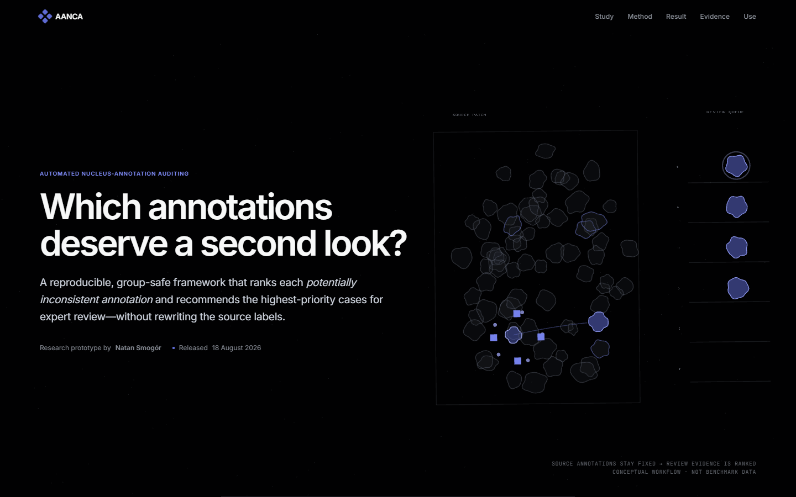

# AANCA

  
  
  
  
  

**Automated Auditing of Nucleus Class Annotations** is a reproducible research
prototype that ranks potentially inconsistent nucleus class annotations for expert
review. It is non-diagnostic, never treats model disagreement as biological truth
and never modifies source annotations automatically.

## Current conclusion

AANCA now has positive evidence that the frozen current system transfers to a new
histopathology source under **controlled label corruption**. It does not yet have the
natural multi-rater and prospective workflow evidence required to claim that it
detects real pathologist errors or improves clinical work.

| Evaluation | Result | Responsible interpretation |
| --- | --- | --- |
| PanNuke primary controlled benchmark | `PRIMARY_STUDY_COMPLETE`; ranking evidence was positive, H4 downstream restoration was adverse | The accepted analysis is permanently `amended_or_exploratory` because outcomes were exposed during recovery |
| NuCLS genuine multi-rater disagreement | `EXTERNAL_VALIDATION_COMPLETE`; frozen ranking gate failed and guided correction changed macro-F1 by `-0.014633`, 95% CI `[-0.026683, -0.002415]` | Natural-error and downstream-improvement claims were not supported |
| MoNuSAC controlled external benchmark | Retrieval precision `0.698852` versus `0.556009` matched random; downstream difference `+0.005526`, 95% CI `[-0.001506, +0.012833]` | Retrieval passed, but downstream and class-safety gates failed; action remained `retain_uncorrected` |
| PUMA frozen new-source controlled confirmation | All seven registered gates passed on 62 held-out case/ROI groups | Supports controlled-noise transfer, not natural/pathologist-error detection; public Git history does not independently timestamp the freeze before results |
| PUMA post-confirmation realism stress | Positive aggregate downstream lower bounds in 9/9 scenarios; every class safeguard passed in only 1/9 | Useful robustness evidence and a binding class-safety warning; exploratory only |
| PUMA observed-label fold sensitivity | All seven sensitivity gates passed with audit-time labels; candidate unchanged | Shows the controlled PUMA result did not depend on clean labels for fold allocation; not independent confirmation |
| Prospective natural-case workflow | Not executed | `CONFIRMATORY_COMPLETE`, clinical utility and automatic natural-data intervention are not claimed |

The exact frozen PUMA endpoint was:

- review precision `0.537739` versus `0.214379` matched random;
- precision difference `+0.323359`, 95% CI `[+0.259251, +0.384944]`;
- candidate macro-F1 `0.646310` versus `0.639884` unchanged and `0.638243`
  matched random;
- candidate minus unchanged `+0.006426`, 95% CI `[+0.003657, +0.009365]`;
- candidate minus matched random `+0.008067`, 95% CI
  `[+0.004093, +0.011947]`.

These values are read from
[`artifacts/puma_new_data_confirmation/results.json`](artifacts/puma_new_data_confirmation/results.json)
and checked by the PUMA evidence-readback script
[`scripts/verify_puma_new_data_confirmation.py`](scripts/verify_puma_new_data_confirmation.py).
Source PUMA annotations remained unchanged.

The PUMA protocol, configuration and result first entered public Git history together
in commit `c5bd44193b2abd67bc7e7f1bd9384aa87435d500`. Internal authorities record
the intended pre-outcome ordering, but GitHub is not independent proof of that timing.
The PUMA verifier rebuilds the source manifest and recomputes saved-evidence metrics
and decisions; it imports maintained project helpers and does not retrain all 44
models from source images. These are explicit reproducibility limits, not missing
positive results.

## What the project can claim

Current evidence supports the following statements:

- group-safe AANCA queues retrieve injected class-label changes more efficiently
  than equal-budget matched random review;
- the frozen selected candidate transferred to previously unused PUMA images under
  the registered controlled-noise experiment;
- in that PUMA experiment the intervention improved downstream macro-F1 over both
  unchanged labels and matched-random intervention with positive whole-group 95%
  intervals;
- the complete software, evidence and claim boundary are inspectable and
  checksum-verifiable.

Current evidence does **not** support these statements:

- that AANCA proves a naturally occurring annotation is wrong;
- that it proves a pathologist made an error or identifies biological truth;
- that the intervention is uniformly safe for every class and realistic error
  mechanism;
- that it improves review time, expert agreement, patient outcomes or clinical
  operations;
- that natural labels may be automatically excluded, relabelled or overwritten.

The binding action for unreviewed natural data is `retain_uncorrected`.

## How AANCA works

1. Preserve `pre_corruption_label`, `observed_label`, corruption metadata and the
   immutable source annotation as separate fields.
2. Split only by `group_id`, at least the complete source patch and stronger patient,
   WSI or case identifiers where the source provides them.
3. Produce model-based audit scores out of fold so a nucleus and its complete source
   group are absent from the model that scores it.
4. Combine calibrated label confidence and fold-safe neighbourhood evidence into a
   fixed expert-review queue.
5. Compare the queue with exact equal-budget matched-random review.
6. Evaluate retrieval and downstream utility separately; a favourable ranking never
   substitutes for a favourable downstream result.

The primary scientific invariants are frozen in [`SPEC.md`](SPEC.md) and enforced in
code and tests.

## Open the presentation

The checked-in English article is a closed, five-file package. It needs no dataset,
GPU or project dependency installation:

~~~powershell
python scripts/present_demo.py
~~~

The launcher verifies every packaged file before serving only on loopback. To check
the package without opening a browser:

~~~powershell
python scripts/present_demo.py --verify-only
~~~

The article preserves the “What the study actually learned.” animation, while mobile
and reduced-motion users receive the same content in ordinary document flow. Its
conceptual WebGL figure has an inline static fallback, so disabling WebGL or blocking
the Three.js module does not leave an empty panel.

## Install and run the portable workflow

Requirements:

- Python `3.12`;
- [uv](https://docs.astral.sh/uv/);
- Git LFS for the released PUMA numeric evidence;
- a lawful local copy of any dataset used for a real-data re-execution.

~~~powershell
git clone https://github.com/Jaqwilk/AANCA.git
cd AANCA
git lfs pull
uv sync --frozen --dev

uv run histo-audit doctor
uv run histo-audit data generate-synthetic --config configs/smoke.yaml
uv run histo-audit experiment smoke --runs-root artifacts/smoke_runs
~~~

The synthetic path validates software behaviour only. It is not medical or natural
annotation evidence.

The lock file resolves the reference Windows/NVIDIA environment with PyTorch CUDA
12.6 wheels. A different accelerator or CPU-only environment should use the official
PyTorch selector while preserving the project versions and scientific configs.

## Reproducibility levels

The repository deliberately separates three different tasks.

### Verify the published presentation

~~~powershell
python scripts/present_demo.py --verify-only
~~~

This verifies the closed article package and its machine-readable current-evidence
summary. It does not recalculate a scientific result.

### Recalculate released evidence

~~~powershell
uv run python scripts/verify_primary_evidence.py
uv run python scripts/verify_nucls_external_validation.py
uv run python scripts/verify_monusac_external_validation.py
uv run python scripts/verify_aanca_selected_candidate.py
uv run python scripts/verify_puma_new_data_confirmation.py
uv run python scripts/verify_nucls_supervised_qc_feasibility.py
~~~

The primary verifier uses the checksum-bound `primary-evidence-v1` release and does
not import the analysis package. NuCLS and MoNuSAC verifiers independently recalculate
their saved numeric evidence. The PUMA script is deliberately described more narrowly
as an evidence readback: it imports maintained AANCA helpers, consumes saved
predictions and convergence flags, and does not independently retrain the 44 models.

### Re-execute from images

Full image-to-result re-execution additionally requires the official dataset files,
their licences, sufficient compute and the governed acquisition checks in
[`DATASET_SETUP.md`](DATASET_SETUP.md). Raw images are not redistributed by this
repository. Some historical fold checkpoints were not retained, so reproduction is
a governed re-execution, not reuse of every original byte.

## Public repository boundary

The current Git tree retains only material with an active scientific, engineering or
presentation role:

- maintained Python source, tests, dependency lock and CI;
- frozen protocols, configs, decisions and status records;
- compact reports, manifests and result authorities;
- Git LFS numeric arrays required by the PUMA evidence readback;
- the checksum-verifiable static presentation and one deliberate README image.

It excludes raw/licensed datasets, local virtual environments, reusable embeddings,
full run workspaces, model caches, superseded previews, browser-test output and
temporary cleanup files. Empty artifact placeholders were replaced by
[`data/README.md`](data/README.md); maintained commands create output directories as
needed.

Do not run `git clean -fdX` in a research workspace: ignored raw data and accepted
local run lineage are not disposable caches.

## Repository layout

~~~text
AANCA/
├── src/histo_audit/          # maintained package
│   ├── auditing/             # review scores and two-queue policy
│   ├── cross_validation/     # group-safe OOF prediction
│   ├── evaluation/           # restoration and downstream utility
│   ├── external_validation/  # NuCLS and MoNuSAC analyses
│   ├── research/             # bounded candidate search and PUMA confirmation
│   ├── representations/      # image, morphology and embedding features
│   └── workflows/            # gates, preregistration and review workflow
├── configs/                  # frozen and portable study definitions
├── scripts/                  # launchers, runners and scoped verification scripts
├── tests/                    # unit, integration, CLI and portability tests
├── artifacts/                # compact published evidence and static article
├── reports/                  # human-readable results and provenance
├── references/               # verified bibliography
├── data/README.md            # ignored local data layout
└── *.md                      # scientific governance and handoff documents
~~~

## Current stage and next phase

Completed vocabulary stages:

- `PIPELINE_COMPLETE`;
- `PILOT_COMPLETE`;
- `PRE_REGISTRATION_FROZEN`;
- `PRIMARY_STUDY_COMPLETE`;
- `EXTERNAL_VALIDATION_COMPLETE`;
- `DEMO_COMPLETE`.

`CONFIRMATORY_COMPLETE` has not been reached. Completion records that a governed
evaluation ran and its evidence was preserved; it does not mean every result was
favourable.

The provisional **AANCA v2 research phase** is `INITIALISED`. It improves the same
core system rather than rewriting the current result. Its promotion path is:

1. recruit new, independent blinded pathologists and preserve consensus,
   disagreement, ambiguity, abstention and insufficient-context outcomes;
2. develop a measured-utility queue only inside nested patient/WSI-group
   cross-fitting;
3. freeze one representation, queue, intervention, review budget and class-safety
   policy before inspecting new confirmation outcomes;
4. run one-shot untouched patient/WSI external confirmation;
5. compare multi-site review with and without AANCA prospectively.

Ranking, downstream confidence intervals, every-class safety, convergence and
workflow utility must pass together before any realistic natural-case improvement
claim. The detailed promotion contract is in [`NEXT_PHASE.md`](NEXT_PHASE.md).

## Key documents

| Document | Purpose |
| --- | --- |
| [`SPEC.md`](SPEC.md) | Frozen terminology, hypotheses, leakage rules and completion vocabulary |
| [`PLAN.md`](PLAN.md) | Milestones, gates and executed/deferred work |
| [`STATUS.md`](STATUS.md) | Current evidence, commands and handoff |
| [`DECISIONS.md`](DECISIONS.md) | Binding scientific and engineering rationale |
| [`PRE_REGISTRATION.md`](PRE_REGISTRATION.md) | Frozen primary and confirmatory analysis definitions |
| [`PUBLIC_EVIDENCE.md`](PUBLIC_EVIDENCE.md) | Primary evidence release and independent recalculation |
| [`reports/aanca_internal_technical_assessment_2026-08-21.md`](reports/aanca_internal_technical_assessment_2026-08-21.md) | Internal evidence assessment; explicitly not external peer review |
| [`reports/nucls_external_validation_results.md`](reports/nucls_external_validation_results.md) | Genuine multi-rater result and boundary |
| [`reports/monusac_current_aanca_external_results.md`](reports/monusac_current_aanca_external_results.md) | Controlled MoNuSAC result |
| [`reports/puma_new_data_confirmation_results.md`](reports/puma_new_data_confirmation_results.md) | Frozen PUMA confirmation |
| [`reports/puma_realism_stress_results.md`](reports/puma_realism_stress_results.md) | Post-confirmation realism and class-safety stress |
| [`reports/puma_audit_time_label_sensitivity_results.md`](reports/puma_audit_time_label_sensitivity_results.md) | Audit-time-label sensitivity |
| [`CURRENT_AANCA_SAFE_INTERVENTION.md`](CURRENT_AANCA_SAFE_INTERVENTION.md) | Current intervention safeguards and fail-closed action |
| [`EXPERT_REVIEW_PROTOCOL.md`](EXPERT_REVIEW_PROTOCOL.md) | Required natural-case blinded review |
| [`PROSPECTIVE_WORKFLOW_PROTOCOL.md`](PROSPECTIVE_WORKFLOW_PROTOCOL.md) | Required with/without-AANCA multi-site workflow |
| [`NEXT_PHASE.md`](NEXT_PHASE.md) | Presentation-ready AANCA v2 evidence programme |
| [`ETHICS_AND_LIMITATIONS.md`](ETHICS_AND_LIMITATIONS.md) | Responsible-use and claim boundary |

Read the first five documents before changing scientific code or claims.

## Validation gates

Every material change must pass:

~~~powershell
uv run pytest
uv run ruff check .
uv run ruff format --check .
uv run mypy src
python scripts/present_demo.py --verify-only
~~~

The maintained GitHub workflow runs the locked checks on Ubuntu and Windows plus the
deterministic synthetic workflow. A failed mandatory gate stops advancement.

## Data terms, licence and citation

Dataset files and pretrained weights retain their own licences and access terms.
PanNuke binaries are not distributed here. The local evidence applies
CC BY-NC-SA 4.0 specifically to the recorded PanNuke `masks/` directory; it does not
establish identical terms for every source file. PUMA is recorded under its official
CC0 authority. Review each source before use.

This repository does not include a standalone general-purpose open-source `LICENSE`.
Do not assume rights beyond the research-prototype statement in
[`pyproject.toml`](pyproject.toml), the dataset terms and dependency licences.

The verified project bibliography is
[`references/references.bib`](references/references.bib).

## Author

Research, implementation and presentation by **Natan Smogór**. Updated
21 August 2026.
